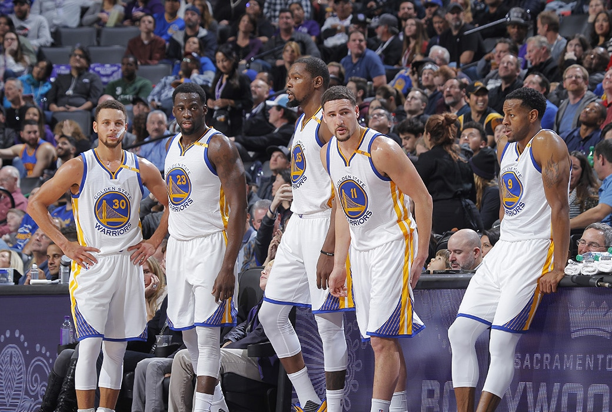
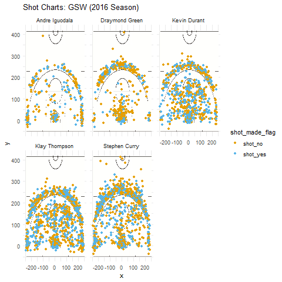
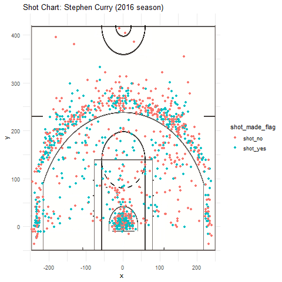
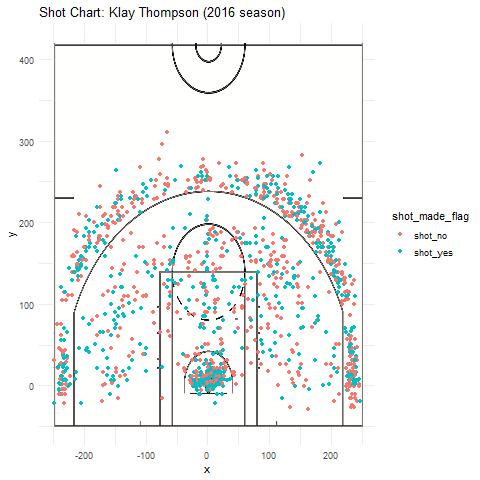

  
```{r, echo=FALSE , include=FALSE, output=FALSE}

#5.1) Effective Shooting Percentage 
library(ggplot2)
library(jpeg)
library(grid)
library(readr)
library(dplyr)
shots_data <- read_csv("../data/shots-data.csv")
two_pointers <- filter(shots_data, shot_type == "2PT Field Goal")
three_pointers <- filter(shots_data, shot_type == "3PT Field Goal")

twopoints_byname <- two_pointers %>% group_by(name) %>% 
  summarize(total = n(), made = sum(shot_made_flag == "shot_yes"), perc_made = made/total*100)%>%
  arrange(desc(perc_made))

threepoints_byname <- three_pointers %>% group_by(name) %>% 
  summarize(total = n(), made = sum(shot_made_flag == "shot_yes"), perc_made = made/total*100)%>%
  arrange(desc(perc_made))

points_byname <- shots_data %>% group_by(name) %>% 
  summarize(total = n(), made = sum(shot_made_flag == "shot_yes"), perc_made = made/total*100)%>%
  arrange(desc(perc_made))

```

#Warriors WOW again
##Lena Kan
```{r out.width='80%', echo=FALSE, fig.align = 'center'}



```


> As the year is coming to an end, another spectacular basketball season is wrapping also. This year, the Golden State Warriors didn't go down without a fight. Finishing strong with 67 overall wins and 15 losses, Steve Kerr has lead the team to remain at the top of the ranks. At the NBA playoffs in 2017, the GSW were able to win the NBA finals against the Cleveland Cavalier following 3 NBA Western Conference Final wins. 

> So how did the warriors manage to maintain their title year after year, season after season? More importantly, what made their extraordinary performance this particular season possible? How did the Warriors become hailed as the "Super-team" by all media and fans? Was it because they acquired free agent Kevin Durant during the offseason? Was the "Fantastic Four" of Stephen Curry, Klay Thompson, Draymond Green and Kevin Durant simply undefeatable? The statistics and data behind their ability to sweep up yet another victory will be thoroughly analyzed and broken down in the following paper.  5 specific players, Stephen Curry, Andrew Iguodala, Draymond Green, Kevin Durant and Klay Thompson will be analyzed. 

> The star players of the thriving NBA team hold a stellar record in playing in their respective positions. Stephen Curry, for example is a strong guard, Draymond Green a skillful forward and defensive player, Andrew Iguodala an undefeatable defensive player, and Kevin Durant with an impressive shooting record on the team and Klay Thompson not afraid to take his shot from anywhere around the court. These 'fantastic five' thus stand out among many of other NBA players. With such an ideal "Dream Team", there is no question that the golden state warriors took advantage of each player's strengths and skills to sweep up another win in history. 

> Codes used to calculate team statistics were created in the R-statistical program and 

```{r eval=FALSE}
facet_shot_chart <- ggplot(data=stacked_tables)+annotation_custom(court_image, -250, 250, -50, 420)+
  geom_point(aes(x=x, y=y, color = shot_made_flag))+
  ylim(-50, 420)+
  ggtitle('Shot Charts: GSW (2016 Season)')+
  theme_minimal()+facet_wrap(~name)+scale_color_manual(values=c("#E69F00", "#56B4E9"))


```
```{r eval=TRUE}
points_byname


```
> This table shows the percentage of all shots made by the golden state warrior players. Kevin Durant is the top scorer of the five players, making over 54% of all the shots that he takes on the court. Though Iguodala follows closely second, it's clear that Stephen Curry and Klay Thompson take the majority of the shots for the golden state warriors team.

> Looking at the shot charts of all 5 golden state warrior players, Kevin Durant has a tendency to shoot frequently from within the key and outside on the rim, and has a high shooting percentage of 60.7% for his two pointers, and successfully makes 38.7% of his three pointers, making him an outstanding and effective shooter on the Golden State Warriors team. He also took a whooping number of 915 shots in total during that basketball season, reaching a mean shot distance of 13.12 inches away from the basket, indicating that he made many of his points through close layups, either through effective Alley Oop Layup shot or a cutting layup-shots. Most of his shots are grouped right under the basket, as he is always ready to receive a pass from a teammate to make that infallible layup of his. His shooting percentage is the highest in the team with an overall percentage of 54.1%. 

```{r out.width='80%', echo=FALSE, fig.align = 'center'}

```
> Stephen Curry never ceases to disappoint either. As one of the world's most famous point guards, Stephen Curry relentlessly proves himself as a necessity to NBA's team and to their wins. Taking even more shots than Durant, 1250 over the entire 2016 season, Curry shoots from an average distance of 18 inches away from the basket, with most of his shot also being cutting layup shots or cutting finger layup shots. Like his teammate Kevin Durant, Curry makes over 54% of his two-point shots, and over 40% of his three-point shots. This makes him a unique point guard, who has an extremely strong shooting percentage from such a far way distance. By taking the most shots out of any one in his team, this outstanding shoot percentage comes at no surprise. Looking at the shot charts of all five players, shots around the three-point rim seem to very dense, and most of the shots are effective, with him making an overall 46.7% pf his shots. 


```{r out.width='80%', echo=FALSE, fig.align = 'center'}


```

> Moving on to our next player, Klay Thompson. Like his Curry and Durant, Thompson is a strong shooting guard and here's why. Observing the shot charts in comparison to other players, Klay Thompson undoubtedly takes the most charts out of all his teammates. Taking a total of 1220 shots in the 2016 season, Thompson also takes his shots from an average of 17.16 inches from the basket, proving that he takes, and makes many of his shots near the basket. However, it is clear that Thompson takes a preference from shooting from any distance on the court. Making 51.2% of his two pointers this season and 42.4% of his three pointers - the highest shooting percentage of three pointers out of anyone in the team, Thompson helps ensure that there is always a high discrepancy is score at any game that the Golden State Warriors play. Thank you Thompson for making the season a high scoring one for the warriors, with a stellar 47.1% of your shots made.

```{r out.width='80%', echo=FALSE, fig.align = 'center'}


```

> Finally, for our analysis of the best defensive players of the star team. Andre Iguodala and Draymond Green, both tall and artfully skilled players, are the core to a strong defensive system of the team. Looking at overall shot charts, these two players take significantly less shots in the and around the rim of the basket. Especially Andre Iguodala, whose shots are very sparse around the basket, serves more a significant defensive players than his counterparts Durant, Curry or Thompson. Draymond Green takes more shots than Iguodala, making many of his shots from inside the key. Iguodala took a total of 371 shots throughout the season, while Green took a total of 578 shots. Even though they take less shots, their shooting percentages for 2 pt. shots are 63.8% and 49.4% for Iguodala and Green respectively. Their shooting percentages for 3 pt. shots are 36% and 31.9% for Iguodala and Green respectively. They both having an overall shooting percentage of 51.8% and 42.4% for Iguodala and Green respectively. As defensive players, the two clearly don't take as many shots, but their shooting percentages remain strong. But a heart of a strong basketball team is a stellar defensive mechanism, and GSW has just that with Iguoadala and Draymond Green.

> Overall, the Golden State warriors have proved themselves once again as one of the world's best basketball teams to ever exist. Hence it must come as no surprise that the earned the coveted title of NBA champions again in 2016, taking a total of 4334 shots as a team in 2016 and with some of the best shooters in the world, making a higher percentage of those shots. Like any good basketball playing strategy, most shots are taking under or near the basket, with Curry and Durant reigning in those cutting layup shots, driving finger roll layup shots, driving layup shots and driving reverse layup shots, making many fade away jump shot and the occasional Alley Oop and dunks. Well done, Golden State Warriors for acquiring the best basketball team the world has ever seen and making impressive records in shooting percentages and teamwork play in basketball history. 